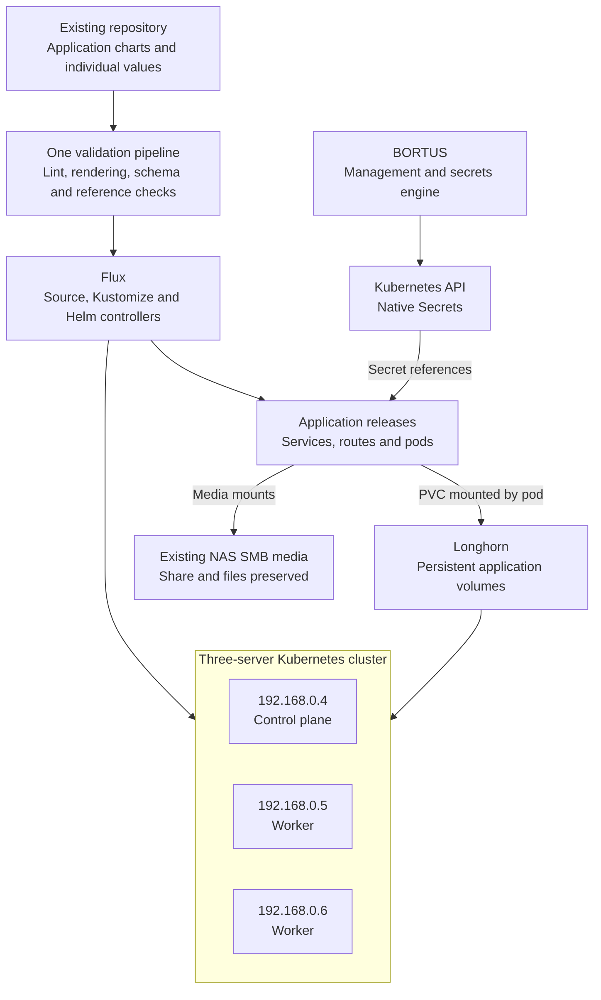
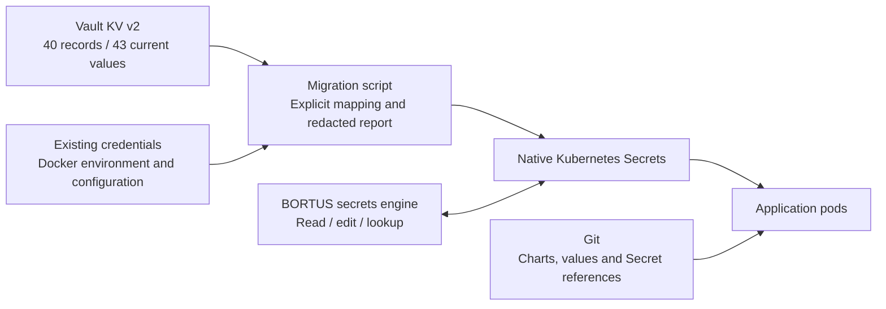
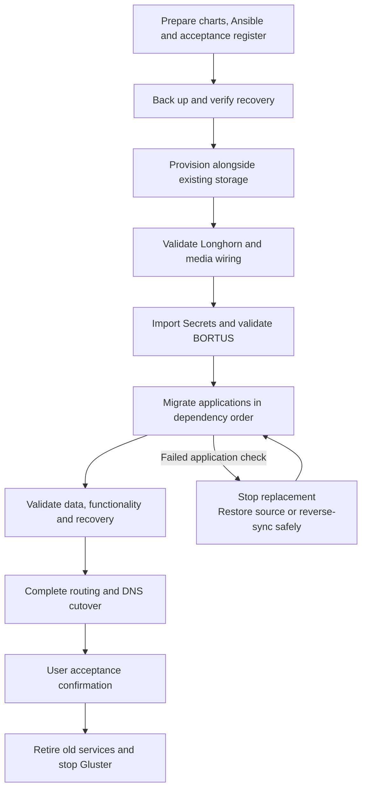
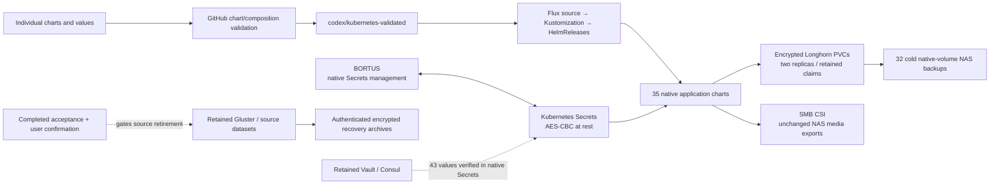

# Kubernetes migration plan and acceptance contract

Approved by the user on 2026-10-09. Execution target: under six hours from execution approval. Data-preservation and acceptance gates remain mandatory.

## Work ownership

- This chat owns cluster migration, server provisioning, chart/values migration, Flux, Longhorn, data preservation, application cutovers, and acceptance evidence.
- BORTUS application development belongs in a separate chat. Its native Kubernetes Secrets integration is a dependency of this migration and must be coordinated without mixing development context into this chat.
- After plan approval, create the migration goal with this full acceptance contract and execution target. Gluster/Vault retirement follows the user's final migration confirmation.

## Verified starting point

Vault was unsealed using the user-supplied key and returned HTTP 200, initialized=true, sealed=false, standby=false. Authenticated inventory found 40 current KV records containing 43 values. Secret values and credentials must not be written into this plan, Git, command arguments, or reports.

| Area | Verified observation |
|---|---|
| Servers | 192.168.0.4 master, 192.168.0.5 worker2, 192.168.0.6 worker1; SSH and sudo work on all three |
| SSH | User james, port 2002, WSL key ~/.ssh/id_ed25519; never copy or print the private key |
| Current cluster | All three are Swarm managers; 32 Swarm services and six standalone containers |
| Destination | Existing Ansible playbook and charts directory in the repository's k8s-rewrite branch |
| Gluster | staging-gfs: three replicated bricks at /gluster/volumes; all connected and online |
| Integrity | No reported split-brain; a small, changing heal backlog references Plex logs |
| Other storage | NAS SMB media/backups, NAS NFS application data, local Plex configurations |
| Secrets | Vault KV v2; BORTUS currently reads its database and pushes secrets to Kubernetes |
| Plex | Three running servers; master has Movies, TV Shows and PVR; workers have Movies and TV Shows |

Repository: https://github.com/jtmb/branconet-homelab/tree/k8s-rewrite/k8s-rewrite

Inspected tree baseline: 25586ef4d5e120b852da1a49b281aa918284c05f.

Approximate state measurements: Gluster 2.1 GB, NFS application data 1.9 GB, master Plex configuration 7 GB. Gluster sizing encountered changing Jackett files and must be repeated after stopping writers. Other Plex configurations must also be backed up and retained.

Data scope clarification during execution, 2026-10-09: the user confirmed FlareSolverr /config and Vault /vault/file and /vault/logs anonymous directories were disposable runtime state. Their original paths were removed by initial Swarm task shutdown before archival; that sequencing error is recorded in MIGRATION_STATUS.md. They are excluded from required dataset recovery on the user's explicit clarification. Vault's authoritative data remains the Consul store on Gluster; all Gluster/NFS/Plex/application datasets retain the original preservation gates. Any other anonymous application data must be protected before task removal.

Each server has approximately 16 GB RAM. Observed root-filesystem free space was approximately 56 GB, 80 GB and 62 GB respectively. These are observations, not approved Longhorn allocations. Worker2 had approximately 3.5 GB available RAM at inspection.

## Acceptance contract

Installation or running pods alone does not satisfy this contract. Every criterion requires recorded evidence.

| ID | Required outcome | Acceptance evidence |
|---|---|---|
| AC1 | Kubernetes operates on the three supplied servers using the adapted Ansible setup | Three Ready nodes; working DNS, networking, scheduling and storage |
| AC2 | One CI/CD pipeline manages deployments | Repository validation -> Flux reconciliation -> releases; successful test change and rollback |
| AC3 | Every repository application and live service is accounted for | Complete source-to-target register; no unexplained omissions |
| AC4 | Each application has its own chart and values | Chart, values, dependencies, image, resources, routes, storage and Secret references validated |
| AC5 | Storage follows the repository's Longhorn approach | Stateful pods mount intended Longhorn PVCs; replica placement, persistence, reattachment and restoration tested |
| AC6 | Existing SMB media and paths are preserved | Appropriate read/write checks, playback, download/import checks and demonstrated requested media integration |
| AC7 | Kubernetes Secrets are authoritative; BORTUS reads and manages them | Import verification, lookup/CRUD, authorization and restart-persistence tests |
| AC8 | Existing application data survives | Consistent backups, verified copies/restores, application checks and retained originals |
| AC9 | Plex becomes one Kubernetes-managed service | One active server; preserved selected library/configuration; playback and relocation between eligible nodes |
| AC10 | Final configuration is reproducible | Ansible, chart values, Flux definitions, recovery instructions and report match the running system |
| AC11 | Gluster/Vault retirement follows acceptance | No remaining consumers; tested recovery; user confirmation before shutdown |

## Target architecture

The existing playbook topology is one control plane and two workers. Longhorn replicates application storage. Document control-plane recovery separately because one control plane does not provide control-plane high availability.

The repository currently uses Longhorn for Plex configuration and SMB CSI for Plex media, both mounted by the application pod. The user's requested Longhorn/media integration is an explicit implementation and acceptance check. Existing files do not establish that connector; demonstrate the wiring before cutover while preserving the share and files. Do not silently change the requested storage architecture or relocate NAS media.

## Repository work before deployment

- Inventory: actual hosts, SSH username/port, interfaces and stable addresses.
- Runtime: avoid the current bootstrap's rewrite/restart of Docker's containerd; use a separate Kubernetes runtime configuration, socket and data directory during coexistence.
- Provisioning: idempotent init/join; remove blanket preflight bypasses and suppressed join failures.
- Charts/values: current directories are Kustomize manifests, with no Chart.yaml or values.yaml. Package existing resources as application charts in the same directory, with individual values, to satisfy AC4.
- Flux: correct mixed installation paths; retain helm-controller, which the current role deletes.
- Coverage: include Homepage and websites in reconciliation; fix the missing nginx-hello reference.
- Storage: resolve every PVC reference, including gluetun-port-pvc; enforce configured replica policy and readiness on all participating nodes.
- Ingress: correct the Deployment readiness check for a DaemonSet; use temporary ports while Swarm owns 80/443.
- TLS: install the cert-manager dependency required by the existing ClusterIssuer.
- Secrets: replace the missing/old database-driven secrets role with native Kubernetes Secrets integration; BORTUS application changes are handled by the separate development chat.
- Versions: pin a compatible Kubernetes/Calico/Longhorn/Flux/CSI combination. Seed defaults are Kubernetes v1.30.0, Longhorn v1.7.2 and two Longhorn replicas; these are not verified effective settings.
- Application versions: initially preserve running versions/digests; perform application upgrades separately.

Do not use reset-and-deploy.sh as the migration entry point. Preserve Gluster bricks, mounted source data, SSH access and recoverability throughout provisioning.

## Workload register scope

Each individual service receives its own migration-register entry, even when related services share a migration wave.

| Group | Workloads | Requirements |
|---|---|---|
| Media | Plex, qBittorrent/Gluetun, Radarr, Sonarr, Bazarr, Jackett, Overseerr, Tautulli, Unpackerr, FlareSolverr, xTeVe, ytdl, repository qbit-monitor | Preserve configuration, paths, permissions, API relationships and processing |
| Websites | APLB, Homepage, Lucinda, Santos, Minecraft website, repository jtmb-dev | Preserve live content/configuration and verify pages/assets |
| WordPress | WordPress, MySQL, Redis, phpMyAdmin | Consistent DB migration, uploads/plugins/themes, inspect Redis state |
| Applications | Ruckus bot/MySQL, Mealie, Vaultwarden | DB integrity and application-level checks; Vaultwarden remains an application |
| DNS/monitoring | Pi-hole, Pi-hole exporter, Minecraft exporter | DNS settings/resolution and exporter targets |
| Standalone game | Euro Truck Simulator server | Preserve configuration and test game connectivity |
| Management/infrastructure | BORTUS, Traefik, Portainer/agents, Vault/Consul | Explicit retained-function mapping, dependencies and retirement |
| Test applications | Whoami, HTTP echo | Routing, storage and deployment smoke checks |

Live VPN: ProtonVPN WireGuard. Repository: ProtonVPN OpenVPN. Align values with the running configuration; do not silently switch provider because additional credentials were supplied.

Plex: one active replica. Proposed primary source is master's plex-media-srv because it includes PVR. Preserve the other configurations and review history/settings differences before accepting consolidation. Validate transcoding on eligible nodes before enabling hardware-dependent scheduling.

Include anonymous Docker volumes and persistent writable-container data in discovery/backup. Observed anonymous volumes include FlareSolverr /config and Vault /vault/logs and /vault/file. Do not prune Docker volumes or discard unexplained datasets.

## Secrets migration and BORTUS dependency

Migration script requirements:

1. Metadata-only dry run maps Vault path/key to namespace/Secret/key.
2. Preserve all 40 current records and legacy aliases without silent deduplication.
3. Import through the Kubernetes API; no values in Git, process arguments or reports.
4. Detect destination conflicts; do not overwrite unrelated keys.
5. Read back and compare values in memory; report only success/failure.
6. Preserve history via recoverable Consul/Vault backup before retirement.

BORTUS development contract: replace database-backed lookup with Kubernetes-backed lookup; preserve authentication/user permissions and explicit namespace/name/key mappings; remove startup database-to-cluster synchronization; preserve unrelated keys during updates/deletes; fail clearly when Kubernetes is unavailable. Keep nonsecret configuration/metadata separate from secret values. Do not add a secrets Git repository or SOPS workflow.

Restrict access to native Secrets, enable encryption at rest and test recovery. Bootstrap/recovery credentials must remain available independently of the cluster they create.

Reference: https://kubernetes.io/docs/concepts/configuration/secret/

## Migration sequence

1. Prepare and back up: freeze register/configuration baseline. Back up Gluster logical filesystem, NFS application state, all Plex configurations, databases, Consul/Vault, anonymous volumes and persistent writable-container data. Verify representative restores. Bricks remain intact.
2. Provision destination: staged adapted Ansible; keep Gluster mounted. Validate networking/existing services after runtime/CNI changes. Temporary ingress avoids occupied ports.
3. Prove storage: test writes, restarts, cross-node attachment, replication and restore. Demonstrate media wiring. Size PVCs from actual data plus growth/snapshot headroom.
4. Establish Secrets/BORTUS: import before consumers start; test reads, edits, permissions, aliases and restart behavior. Coordinate app code through its separate chat.
5. Migrate: test/static apps first; databases and dependents next; media/Plex; game services and DNS. Preserve existing container paths.
6. Cut over traffic: validate replacement routes; release old conflicting listeners; transfer ingress/DNS; verify TLS/external access.
7. Accept/retire: complete evidence report and obtain user confirmation. Retire replaced Swarm/standalone workloads and Vault/Consul after consumers are gone. Stop Gluster after verification; retain brick directories/recovery backups.

Per stateful application: initial copy -> stop source writers -> consistent final copy/dump -> verify -> start replacement -> application tests -> route traffic.

Do not copy live database directories while writing. Use consistent MySQL dump/restore or clean-stop procedures, and consistent backups/clean-stop copies for SQLite-backed applications. Investigate pending Gluster log entries and recheck healing after writers stop.

Rollback after replacement writes must preserve those writes and restore/reverse-migrate consistently. Restarting an outdated source alone is insufficient.

## Execution budget

Working time boxes after execution approval; mandatory data gates apply throughout.

| Elapsed | Deliverable |
|---|---|
| 0:00-1:00 | Repository fixes, chart/value preparation, scripts, backups and restore checks |
| 1:00-2:00 | Kubernetes, networking, Flux, Longhorn and temporary ingress |
| 2:00-2:30 | Storage proof, Secret import and BORTUS verification |
| 2:30-4:30 | Application migration waves |
| 4:30-5:15 | Functional, persistence, relocation and recovery checks |
| 5:15-5:45 | Production routing/DNS and acceptance report |
| 5:45-6:00 | Contingency and retirement preparation |

Run independent preparation, backups and checks concurrently where safe. Stateful cutovers follow dependency order. If acceptance fails, preserve source data and pause that application's cutover rather than forcing retirement for the clock. User confirmation gates final Gluster/Vault retirement.

## Acceptance-report template

| Field | Required content |
|---|---|
| Service | Source service/container and target chart/release |
| Configuration | Chart, values, image digest and dependencies |
| Storage | Source dataset, destination PVC, media mounts and permissions |
| Secrets | Namespace/name/key references only |
| Migration evidence | Backup, final-copy verification and DB checks |
| Functional evidence | Application tests and production endpoint |
| Recovery evidence | Restart, relocation and restore/rollback results |
| Status | Pending / prepared / migrated / accepted / blocked |
| Remaining work | Issue, next action and affected criterion |

Every change updates affected Ansible tasks/templates, chart values, Flux configuration, register and acceptance evidence together. Maintain current evidence and explicit unresolved items; never describe unrun checks as passed.

## Initial execution status

- Planning and read-only inventory completed; Vault unsealed by explicit user request.
- Plan approved; migration execution authorized.
- Migration goal activated at 2026-10-09 14:30 UTC (10:30 a.m. Toronto); execution target before 20:30 UTC (4:30 p.m. Toronto).
- Source checkout initialized on codex/kubernetes-migration at the inspected baseline. BORTUS development requested in a separate worktree/chat.
- Cluster provisioning, data movement, Secret import, repository changes and application tests have not yet been performed.
- BORTUS development will be delegated to a separate chat; cluster migration stays in this chat.

## As-built state and outstanding acceptance

At the 21:32 UTC check on 2026-10-09, the three Kubernetes nodes, all 36 HelmReleases (35 application charts plus cert-manager), and all active Deployments were Ready. CI run 37993276601 validated revision 2ddeefd49d92bb63e622a830ec88a8baf3b280ec, which Flux reconciled successfully. Source application containers are stopped; source Vault/Consul and Portainer/agents remain retained. Each application's chart keeps its own configuration and native Secret references. Gluster bricks and source datasets remain intact. Operational cutover reached Ready at 20:17:48 UTC, within 5 hours 48 minutes; full acceptance and source retirement remain open.

Proven checks include cold-copy manifests, encrypted storage persistence/relocation/snapshot restoration, an independent NAS BORTUS database restore, isolated etcd restoration matching 349 Secret ciphertext records, recovery of the exact deployed BORTUS image from its authenticated encrypted NAS archive, native BORTUS auth/CRUD/aliases/dashboard/outage/restart, production HTTPS/DNS routing, a single Plex library/playback/relocation, qBittorrent's retained 203-entry queue and Arr download-client tests, the monitor's real queue/forwarded-port/restart behavior, and controlled ZIP extraction through existing SMB CSI with the deployed Unpackerr image. An actual CI/Flux rollout and rollback preserved the HTTP echo response and claim. The actual evidence and its limits are in MIGRATION_STATUS.md and evidence/*.json.

The original removed Redis writable state remains unrecovered and its acceptance exception remains unresolved. The user-confirmed disposable anonymous directories are limited to the three specifically named FlareSolverr/Vault runtime paths. No broader data-loss exception is assumed. The original Traefik dashboard route/auth hashes/image are restored; authenticated UI/API proof requires its existing working login. Discord notification delivery, an ETS2 game-client join and a completed real Arr download/import have not been tested; legacy xTeve TCP 1901 has no observed listener. All five Sonarr indexers and two Radarr indexers pass configuration tests; two Radarr failures also have pre-migration failure history in the retained source database (see evidence/media-indexer-proof.json), and no settings were saved. Current queued paths have matching visibility in the Arr pods, qBittorrent pod and original SMB mount (evidence/media-activity-proof.json); no imports since cutover were recorded, and this does not replace the full import test. xTeve LAN multicast discovery now passes on all three host interfaces using a stateless responder in its chart; original image, tuner identity, two tuners and claims are preserved (evidence/xteve-ssdp-proof.json). LAN HTTPS uses the default untrusted local certificate. These limits remain explicit rather than being treated as passed checks. Final Gluster/Vault retirement requires user confirmation after reviewing the acceptance record.
