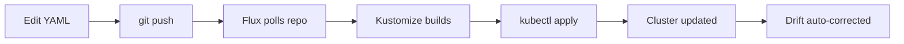

# Flux GitOps Guide

## Overview

Flux CD watches `charts/` in this repo and applies any changes to the cluster automatically. Every app lives in its own `charts/<name>/` subdirectory, giving Fleet-style per-app visibility.

## How Deployments Work



1. **You change a manifest** — edit any `.yaml` in `charts/` or add a new app
2. **Commit & push** to the `k8s-rewrite` branch
3. **Flux detects it** — `GitRepository` polls GitHub every 5 minutes
4. **Kustomize builds it** — `charts/kustomization.yaml` flattens all subdirectories into one bundle
5. **Applied server-side** — Flux runs the equivalent of `kubectl apply -k charts/ --server-side`
6. **Drift correction** — manual `kubectl edit` changes get reverted
7. **Pruning** — deleted files get removed from the cluster

## Directory Structure

```
k8s-rewrite/
├── charts/
│   ├── kustomization.yaml          ← Root: Flux builds this
│   ├── http-echo/                   ← Each app = one subdirectory
│   │   ├── kustomization.yaml
│   │   ├── namespace.yaml
│   │   ├── deployment.yaml
│   │   ├── service.yaml
│   │   ├── ingress.yaml
│   │   └── ingressroute.yaml
│   ├── plex/
│   ├── nginx-hello/
│   └── whoami/
├── clusters/
│   ├── prd/flux-system/             ← Production cluster bootstrap
│   ├── dev/flux-system/             ← Dev cluster bootstrap
│   └── README.md
└── ansible-playbook/roles/gitops/   ← Automates Flux install + bootstrap
```

## View Status

### Dashboard (Fleet-style Hierarchy)

The `/flux` page in the dashboard shows a Rancher Fleet-style expandable tree view:

- **GitRepositories** are root nodes, grouped by their `sourceRef`
- **Kustomizations** appear as children of the GitRepository they pull from
- **HelmReleases** appear as children of the GitRepository or Kustomization they reference
- Sub-kustomizations (e.g., `flux-system` Kustomization spawning per-app Kustomizations) nest recursively
- Each node shows live readiness status (green/amber/red), last sync time, and short revision hash
- Expand/collapse with tree-line indentation
- Sync and Delete buttons are available on root GitRepository rows

The tree is powered by `GET /api/flux/hierarchy` which queries GitRepositories, Kustomizations, and HelmReleases from the cluster, links them by `sourceRef.name`, and merges DB metadata (auth method, ID) for tracked repos.

### kubectl / CLI

```bash
# What Flux resources are running?
kubectl get gitrepositories,kustomizations -n flux-system

# Fleet-style listing (with flux CLI)
flux get sources git -n flux-system
flux get kustomizations -n flux-system

# Detailed per-app status
flux get kustomizations --watch

# See what Flux would change
flux diff kustomization branconet-charts -n flux-system
```

## Add a New App

1. Create `charts/<name>/` directory
2. Add `kustomization.yaml`:

```yaml
apiVersion: kustomize.config.k8s.io/v1beta1
kind: Kustomization
resources:
  - namespace.yaml
  - deployment.yaml
  - service.yaml
```

3. Add your Kubernetes manifests
4. Register in `charts/kustomization.yaml`:

```yaml
resources:
  - ./http-echo
  - ./plex
  - ./<name>          # ← add this
```

5. Commit + push — Flux auto-syncs within 5 minutes

## Manual Sync

```bash
# Sync everything immediately
flux reconcile kustomization branconet-charts -n flux-system

# Or without flux CLI:
kubectl annotate kustomization branconet-charts -n flux-system \
  reconcile.fluxcd.io/requestedAt="$(date +%s)"
```

## Pause / Resume

```bash
# Stop Flux from touching the cluster entirely
flux suspend kustomization branconet-charts -n flux-system

# Resume
flux resume kustomization branconet-charts -n flux-system

# Without flux CLI:
kubectl patch kustomization branconet-charts -n flux-system \
  --type merge -p '{"spec":{"suspend":true}}'
kubectl patch kustomization branconet-charts -n flux-system \
  --type merge -p '{"spec":{"suspend":false}}'
```

## Drift Detection

Flux detects manual changes (`kubectl edit`, `kubectl scale`, etc.) and reverts them within 5 minutes.

- `READY: True` — cluster state matches Git
- `READY: False` — drift detected, check with:
  ```bash
  kubectl describe kustomization branconet-charts -n flux-system
  ```

## Troubleshooting

### "kustomize build failed"
```bash
# Test locally what Flux sees:
kubectl apply -k charts/ --dry-run=server
```

### Stale revision (not picking up new commits)
```bash
# Check Flux can reach GitHub:
kubectl get gitrepository branconet-charts -n flux-system -o yaml | grep -A10 status
```

### "Reconciliation in progress" stuck
```bash
kubectl get events -n flux-system --sort-by='.lastTimestamp' | tail -20
```

### New app not appearing
Did you:
1. Create `charts/<app>/kustomization.yaml`?
2. Add it to `charts/kustomization.yaml` resources?
3. Commit **and push** both changes?

Flux watches the **remote** repo, not local files. Changes only apply after `git push`.

## Bootstrapping a New Cluster

See `clusters/README.md` for the full bootstrap procedure and multi-cluster setup.

Quick bootstrap:
```bash
flux bootstrap github \
  --owner=jtmb \
  --repository=branconet-homelab \
  --branch=k8s-rewrite \
  --path=./k8s-rewrite/clusters/prd \
  --personal
```

## How It Compares to Fleet (Rancher)

| Feature | Fleet | Flux |
|---------|-------|------|
| Repo scan | Auto-discovery (`fleet.yaml`) | Explicit (`kustomization.yaml` per dir) |
| Per-app status | `fleet bundle list` | `flux get kustomizations` |
| Self-healing | Yes | Yes (`prune: true`) |
| Multi-cluster | Cluster groups | Separate bootstrap per cluster |
| Sync interval | Per bundle | Per Kustomization |
| Drift detection | Built-in | Built-in + alerts |
| Dependencies | None (built into Rancher) | Standalone controllers |

## Overview

Flux CD watches this Git repository and automatically applies any changes to the cluster. Every app in `apps/` is a separate Flux Kustomization, giving you Fleet-style per-app visibility.

## Directory Structure

```
k8s-rewrite/
├── charts/
│   ├── kustomization.yaml          ← Root: references each app subdirectory
│   ├── http-echo/                   ← Each app = one kustomization
│   │   ├── kustomization.yaml
│   │   ├── namespace.yaml
│   │   ├── deployment.yaml
│   │   └── service.yaml
│   ├── plex/
│   ├── nginx-hello/
│   └── whoami/
└── clusters/home/flux-system/      ← Cluster bootstrap config
    └── gotk-sync.yaml
```

## View Status

```bash
# Fleet-style listing
flux get kustomizations

# Detailed per-app status
flux get kustomizations --watch

# Check a specific app
flux get kustomization http-echo

# See what Flux would change
flux diff kustomization http-echo
```

## Add a New App

1. Create `charts/<name>/` directory
2. Add `kustomization.yaml`:

```yaml
apiVersion: kustomize.config.k8s.io/v1beta1
kind: Kustomization
resources:
  - namespace.yaml
  - deployment.yaml
  - service.yaml
```

3. Add your Kubernetes manifests
4. Register in `charts/kustomization.yaml`:

```yaml
resources:
  - ./http-echo
  - ./plex
  - ./<name>          # ← add this
```

5. Commit + push — Flux auto-syncs within 5 minutes

## Manual Sync

```bash
# Sync everything immediately
flux reconcile kustomization branconet-charts

# Sync one app
flux reconcile kustomization http-echo
```

## Pause / Resume an App

```bash
flux suspend kustomization plex
flux resume kustomization plex
```

## Drift Detection

Flux detects manual changes (kubectl edit, etc.) and reverts them within 5 minutes. Run `flux get kustomizations` — any drift shows as `False` in the `READY` column.

## Bootstrapping a New Cluster

```bash
# Install Flux CLI
curl -s https://fluxcd.io/install.sh | bash

# Bootstrap from this repo
flux bootstrap github \
  --owner=jtmb \
  --repository=branconet-homelab \
  --branch=k8s-rewrite \
  --path=./k8s-rewrite/flux-system \
  --personal

# Or via Ansible:
ansible-playbook -i inventory/production.ini playbooks/site.yml --tags gitops
```

## How It Compares to Fleet

| Feature | Fleet | Flux |
|---------|-------|------|
| Repo scan | Auto (fleet.yaml) | Explicit (kustomization.yaml) |
| Per-app status | `fleet bundle list` | `flux get kustomizations` |
| Self-healing | Yes | Yes (prune: true) |
| Multi-cluster | Cluster groups | Separate Kustomization per cluster |
| Sync interval | Configurable per bundle | Configurable per Kustomization |
