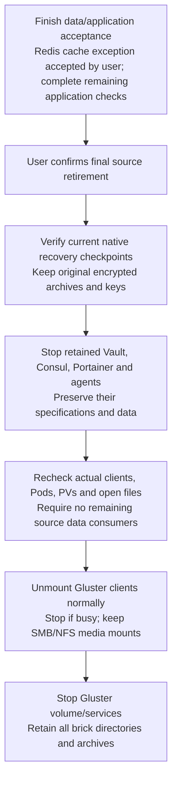
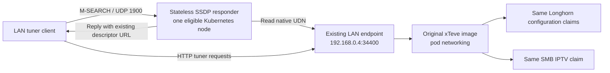
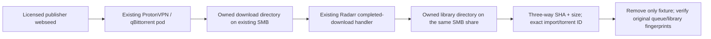
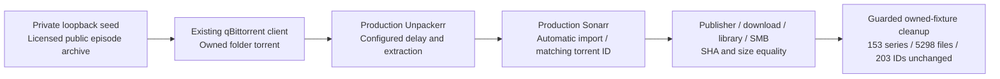

# Approved cluster migration operations

The acceptance contract and architecture are in [PLAN.md](../PLAN.md); current evidence is in [MIGRATION_STATUS.md](../MIGRATION_STATUS.md). BORTUS application development is handled in its separate chat/worktree. Cluster operations remain with the migration owner.

## Current operation and recovery

The checked-in Ansible defaults now describe the migrated cluster: native ingress on 80/443, Pi-hole on 53 TCP/UDP and 8079, conditional LAN DNS, Flux activation and the existing NAS CIFS backup target. DNS/ingress/gitops tags were applied successfully against all three hosts. Application HelmReleases use the CI-published codex/kubernetes-validated branch and individual values. Raw legacy manifests in chart folders are reference material; only the Helm templates are reconciled.

For infrastructure recovery, invoke run-ansible.py with --recovery-bootstrap and appropriate stage tags, supplying its sudo JSON through a protected stdin pipe. This explicitly overrides public-port cutover, native-Pi-hole dependency and Flux activation to false. Before recovery of existing data, recover the original Kubernetes PKI/API encryption configuration, kubeconfig and Longhorn encryption key from the authenticated configuration archives. Do not create replacement keys for existing encrypted volumes. Restore the consistent etcd snapshot using the matching API encryption keys, then recover native Secrets and Longhorn claims from the NAS; establish healthy storage/DNS before enabling Flux and public routes. The isolated etcd and BORTUS NAS restore tests prove those recorded restore cases; they do not establish a complete three-host disaster rebuild.

Native backups use cifs://192.168.0.8/container_backups/k8s-migration-20261009/longhorn and the native longhorn-system/longhorn-backup-cifs Secret. Media exports and their paths remain unchanged. Thirty-one migrated application volumes have completed cold NAS backups; an independent BORTUS database restore passed decryption, SHA equality, table counts and integrity checks. The later repository-only monitor state also has a completed cold NAS checkpoint, bringing backed-up volume coverage to 32, including the two now-retained excluded game volumes. Backup holders are removed only after backup completion; incomplete runs retain their evidence and require inspection before repetition.

The original HTTPS Traefik dashboard is restored at proxy.branconet.lan/dashboard/ with unchanged BasicAuth hashes in traefik/traefik-dashboard-config. migrate-traefik-dashboard.py reads the authenticated retained source configuration directly into that native Secret, fails on conflicts, and writes only deployment references and metadata to Git. Both Ansible and Flux use the immutable original Traefik digest; the dynamic file provider routes to api@internal without enabling an insecure API listener. Source hashes and denial checks are verified; authenticated UI/API proof still requires the existing working dashboard password. traefik-dashboard-proof.py accepts optional existing passwords through --credentials-stdin and never reports them or bodies. BORTUS's existing native Secret role can read the configuration; no app changes were needed.

Keep migration_dashboard_enabled false during --recovery-bootstrap until native Secrets are restored. Then enable the persisted source dashboard configuration before final ingress reconciliation. The bootstrap watcher-limits tasks persist fs.inotify.max_user_instances=1024 at /etc/sysctl.d/98-branconet-inotify.conf; the scoped --tags watcher-limits stage was applied and read back on all three hosts after an exhausted master quota prevented file-provider startup. Dynamic watching remains enabled. Following watcher recovery, an actual two-replica restart loaded the protected route successfully. The subsequent encrypted etcd/NAS restore explicitly verified the new dashboard Secret; retain the original API encryption keys.

Application legacy published ports are recorded in evidence/application-port-cutover.json. Their original Docker specifications are encrypted in authenticated operator/NAS rollback files. Source application Services remain defined at zero replicas, with their published ports transferred to native Services. Vault/Consul and Portainer/agents remain running. A TCP connection proves routing only; application APIs/content require their separate evidence. Legacy xTeve TCP 1901 has no observed backend listener; its 34400 web/tuner route works and LAN SSDP discovery passed on all three interfaces.

qBittorrent retains its original password hash and 203-entry queue. The correct native consumer credentials were recovered from retained download-client settings. Gluetun admits inbound Web UI traffic on 8112 while torrent egress uses the preserved ProtonVPN WireGuard tunnel. The monitor reads the negotiated forwarded-port claim and persists its notification bookkeeping on its own Longhorn PVC. The user authorized restoration of the original automatic Discord alerts: client status, VPN-port updates, new downloads and stuck metadata on; download-complete off. One earlier explicitly authorized migration test delivered from the production monitor pod through the native webhook. Live rollout/environment/storage verification is recorded in evidence/monitor-alerts-restoration.json; every event type is not artificially triggered. The webhook value remains only in native Secrets.

For rollback after a destination receives writes, first stop that destination writer and take a recoverable checkpoint. Compare/synchronize the destination changes into a reviewed recovery copy before restarting a retained source. Restoring old Docker port specifications alone does not restore new application writes. Keep source Gluster bricks, cold archives and partial migration claims until the acceptance ledger is complete and final retirement is confirmed by the user.

## Gated source retirement

The read-only evidence/retirement-readiness.json audit inventories the actual Gluster mount targets and remaining source containers. Six Docker containers remain across four services: cicd_vault, cicd_server-bootstrap, portainer_portainer and the three portainer_agent tasks. Portainer and Consul still mount original Gluster data. No active native Pod directly mounts the discovered Gluster paths and no native PV uses those Gluster paths/drivers. All three /gluster/volumes directories remain present. This is a consumer inventory, not approval or proof that every application scenario has passed.



Re-run the privileged consumer/open-file audit after stopping the approved source services; a prior inventory cannot authorize shutdown of a newly discovered consumer. Do not force or lazily unmount busy clients, delete bricks/claims/backups, or disable NAS media exports. The separate read-only /mnt/migration-gluster-read client on worker2 and /mnt/container-program-files clients on all three nodes must be considered alongside source containers. Root/container filesystem visibility alone does not establish active data consumption; inspect actual holders before shutdown. Restore the original Vault data with its original user-held unseal material if rollback requires that encrypted source store. The authoritative replacement secrets recover from the tested native etcd snapshot using the retained Kubernetes encryption keys.

## Operator tools and metadata

Run migration tooling from WSL with the existing SSH identity. `scripts/migration/install-tools.py` installs checksum-verified age, Flux, Helm and kubectl into `~/.local/share/branconet-migration/bin`, leaving other installations intact. It records upstream URLs/checksums in an operator-local download manifest.

`scripts/migration/inventory.py --output evidence/live-inventory.json` captures current service/container/image/mount/port metadata from all three hosts. It deliberately excludes environment values, raw labels, command arguments and credential files. The source-to-target register must include both Swarm services and standalone containers, including anonymous volumes.

Run register.py with the isolated Python environment to produce SERVICE_REGISTER.md and evidence/service-register.json from the saved baseline. It maps every live source instance to an application chart or an explicit replacement contract, and adds repository-only applications. Replacement entries for Vault/Consul and Portainer/agents remain pending until retained data and replacement behavior are verified; no source service is silently omitted.

That baseline register already exists. Do not rerun register.py or refresh-migration-state.py after production promotion: their preparation defaults replace accumulated acceptance/release state. Run update-acceptance-register.py to enrich the retained baseline with current HelmRelease/PVC metadata, native Secret references (names/keys only), per-service cold backups and scoped evidence. False or absent historical checks remain explicit; this tool never converts HTTP/TCP readiness into full functional acceptance.

pipeline-rollback-proof.py demonstrated a real HTTP echo annotation rollout and rollback through Git, successful validation, the validated branch and Flux. Evidence preserves each commit/CI run, new Pod UID, unchanged PVC/volume and unchanged response hash. It uses Windows Git for the shared Windows checkout to avoid WSL line-ending false positives. It refuses to repeat over an existing report; review and preserve previous evidence before any repeat. This small canary tests the deployment pipeline, not data rollback after application writes.

source-status.py records replicated/global source counts and standalone health without environment values. For Pi-hole startup diagnosis it retains only error/warning lines and excludes credential-bearing lines. Restart command success is not readiness evidence; investigate any source below its recorded desired count before accepting restoration.

Pi-hole currently has a temporary Swarm constraint node.hostname==workernode2 because its worker1 FUSE client cannot stat gravity.db even though all bricks retain the file. Preserve this existing database rather than initialize a replacement. Original service configuration remains in the encrypted baseline backup; remove the temporary constraint only after the relevant mount/readiness or Kubernetes cutover is verified.

check-source-dns.py sends ordinary UDP and TCP DNS queries through port 53 of each node, validates response ID/success/answers and records evidence. A healthy Pi-hole container alone does not prove all routing paths work. This checks source restoration; destination Kubernetes DNS requires separate pod-level checks after provisioning.

Raw runtime configuration and credentials belong only in encrypted recovery backups outside Git. Initial copies of active data are staging copies, not accepted consistent backups. Final database copies require application-consistent backup or stopped writers and verified restoration.

`scripts/migration/backup-config.py` receives its sudo credential through stdin, captures runtime/host configuration, encrypts it with the existing WSL SSH public key, and verifies recovery using the matching private key without displaying either key or configuration values. It stores encrypted copies in the operator's isolated recovery directory and `/mnt/container-backups/k8s-migration-20261009`, checks their ciphertext checksums, and writes a metadata-only evidence report. This proves configuration recoverability; application-data backups are a separate gate.

Repeat configuration capture after Kubernetes/storage provisioning. It includes /etc/kubernetes files (PKI, kubeconfigs, API encryption and LUKS recovery key), independent containerd configuration and its/kubelet systemd units. Do not use this configuration snapshot as an etcd database backup; control-plane database recovery needs a consistent etcd snapshot as a separate check.

Each migration application now has its own `Chart.yaml`, `values.yaml` and Helm template beneath the existing charts tree. `enabled: false` and zero replicas are preparation defaults. Activation requires `migration.verified`; packaging validation alone does not establish that storage, native Secrets, live configuration, or application tests are complete. Legacy raw manifests remain reference sources and must not be reconciled alongside Helm releases. Charts with an empty resources list explicitly require implementation; the CI validator rejects incomplete packages.

`chartify.py` prepares packages from sanitized live image metadata and existing manifests without enabling them. `validate-charts.py` checks Helm lint, staged rendering, integer replica types and the blocked activation path. Its `--allow-incomplete` switch is for local preparation evidence only; repository CI requires all manifests to be implemented. Kubernetes schema and functional verification remain separate acceptance checks.

`measure-storage.py` reads data path sizes and ownership through SSH/sudo supplied on stdin. Size errors remain explicit. PVC allocation must use completed measurements, replica count, free space and reserve; existing source PVC estimates are not accepted as measured capacities.

`complete-live-charts.py --refresh-live` constructs prepared live workload resources from the original sanitized source inventory, using measured data sizes for Longhorn claims and the same SMB directories. It retains legacy reference files, keeps workloads disabled, records source argument and Docker-host dependencies for review, and carries Homepage annotations forward. Run it only during preparation: it replaces prepared resource lists. It wires Gluetun as a restartable init sidecar in the qBittorrent pod; the separate Gluetun package owns its PVCs and live WireGuard runtime Secret reference. Startup/readiness use the upstream Gluetun healthcheck command. VPN egress, startup behavior, kill-switch isolation and forwarded ports still need live tests. BORTUS manifests remain a separately delivered dependency.

`import-secrets.py --kubeconfig <protected-operator-path>` prepares a metadata-only import inventory; adding `--execute` creates native Kubernetes Secrets and compares every value in memory with API readback. It reads Vault and age-encrypted original Docker configuration directly; no plaintext export is created. Existing unequal Secrets fail with a conflict. Vault records use the `bortus-secrets` namespace with original-path/type annotations; application runtime environments use their own namespaces. BORTUS provider mapping, dependency host rewrites, secret rotation and at-rest ciphertext verification require separate live checks before acceptance.

The Ansible runner writes progress into its protected operator log while it runs, so a provisioning failure can be diagnosed without waiting for the whole stage. Credentials arrive through the runner's stdin, then are passed to the Ansible child through an in-memory process environment lookup; no password is in argv or a plaintext file. This avoids Ansible 2.21 resolving /dev/stdin to a nonexistent pipe filename. Each site play explicitly loads ../group_vars/all.yml because the playbook lives below the inventory/group-vars parent directory.

`redis-audit.py` queries only Redis persistence/key-count metadata and WordPress cache-plugin/configuration presence. It does not export keys or values and does not establish historical recovery. Redis source task state had no data mount; its unrecovered historical cache was explicitly accepted as disposable by the user on 2026-10-09, retain new snapshots before further task shutdowns, and provision durable target storage if persistence is required.

`fix-worker-dns.py` records worker2's prior per-link DNS and sets its runtime systemd-resolved DNS to the already verified homelab resolver 192.168.0.6. It changes neither persistent network files nor Pi-hole listening policy. The original runtime resolver must be reconsidered during final DNS cutover and rollback; its exact prior value is in evidence/worker-dns-override.json.

`build-bortus-image.py` builds the separately delivered app commit 1438b278cdf21e98429b4836c018636b01b982a3 using source Docker on the master. Its streamed context excludes local environment files, databases, node_modules, tests and build output; it pins kubectl to the cluster version. Building an image does not run or deploy BORTUS and is not live native Secret acceptance. Protected build logs and metadata record actual build results.

`network-proof.py` runs two bounded test pods on separate workers, checks Kubernetes service DNS in each pod, and pings each peer pod across nodes. It records actual image IDs and node/runtime versions; test pods remain for diagnostic work and are not production workloads.

After post-provision configuration recovery passes, `operator-kubeconfig.py` recovers admin.conf directly from the authenticated encrypted backup to the operator runtime directory with mode 0600 and verifies the API. It never writes the credential to Git or reports it. Configuration backup metadata keeps prior snapshots instead of replacing their historical references.

Native import also creates fresh stable BORTUS signing and lookup keys in bortus/bortus-runtime; repeated execution reads that existing object rather than generating a replacement. The importer creates an explicit metadata-only bortus-secret-aliases ConfigMap: Vault path aliases for single-key records, path/key aliases for each field, and fully explicit native runtime references. Values are absent from its saved alias map. Live BORTUS read/CRUD/lookup and etcd ciphertext checks remain acceptance gates.

`distribute-bortus-image.py` streams the clean, separately delivered image into each independent Kubernetes runtime and verifies actual cached manifest digests. Successful import stdout is not tag evidence; existing verified images skip retransmission. The current staging chart uses that exact cached tag with imagePullPolicy Never until an authenticated image publication pipeline is selected.

The deployed image export is also preserved independently of the development worktree: evidence/bortus-image-recovery.json records its protected operator/NAS age archives, ciphertext checksum, full authenticated decryption and image-configuration digest. To recover, authenticate/decrypt that archive into the protected operator path recorded by evidence/bortus-image-distribution.json, with mode 0600, and verify its recorded archive SHA before importing. Then supply sudo through protected stdin to distribute-bortus-image.py, which requires the recorded export SHA and identical runtime manifest digest on all three nodes. No app rebuild or separate worktree is required for this restore path. The original build helper is historical delivery tooling with a fixed development-worktree path; do not use it as the disaster-recovery entry point. BORTUS remains on the same image and its Secrets/database recover through their separately tested backups. This proves exact image-artifact recovery, not a full three-host rebuild.

`deploy-bortus-staging.py` requires three matching cached images, native import readback and Longhorn device/relocation/restore proof, then performs an API server dry run and installs a private one-replica Helm release. The BORTUS-only staging gate allows functional testing before full acceptance and rejects Ingress/IngressRoute or external Service resources. It does not mark migration.verified or applicationChecksPassed true. Public routing requires separate completed acceptance.

`bortus-live-proof.py` reaches staging through a loopback port forward, bootstraps the james operator account with fresh credentials retained only at bortus/bortus-operator-access, and locks registration after creating a readonly acceptance account. It compares every imported Vault lookup alias in memory; checks native CRUD, version conflicts and preservation of unrelated keys/metadata; then restarts the app and proves Secret, session and runtime-key persistence. Tests use dedicated acceptance objects and never rewrite imported production values. Account credentials and HTTP bodies are not reported. Dashboard and live-outage acceptance remain separate.

`backup-etcd.py` takes a consistent snapshot with etcdctl, encrypts it directly into protected operator/NAS recovery files, authenticates decryption, and restores it with etcdutl into an isolated test pod. The pod has no service-account token and denies network ingress/egress; its restored etcd listens on loopback only. Actual restored Secret ciphertext is compared in memory, including every imported encrypted Secret. This follows the official [etcd recovery procedure](https://etcd.io/docs/v3.7/op-guide/recovery/). It never restores over production etcd. Native API encryption keys must also remain recoverable from encrypted configuration backups. Repeat snapshot recovery after later native Secret changes before final retirement.

`verify-secret-encryption.py` reads each imported registry record through etcdctl inside the control-plane etcd pod and verifies the configured AES-CBC prefix in memory. It exports neither ciphertext nor plaintext. API readback comparison and encryption verification address different acceptance requirements.

The Longhorn role installs external-snapshotter v8.6.0 CRDs/controller for CSI snapshot recovery. `storage-proof.py` creates only dedicated migration-system test claims: it checks two replicas on different nodes and the actual LUKS block-device header, writes a marker, snapshots it, writes a newer marker, relocates the source claim to the other worker and restores the older snapshot into a separate claim. Existing source/application volumes are untouched. Test claims/pods/snapshot are retained; inspect them before rerunning. This proves storage primitives, not migrated application or off-cluster backup recovery.

`review-live-integration.py` recovers effective source commands/arguments only from authenticated encrypted configuration and stores them in native launch Secrets. Chart commands expand references through environment variables; argument values never enter YAML. It pins live source digests and rewrites recognized same-namespace service hostnames in native runtime Secrets. Unresolved host/IP dependencies remain metadata-only audit entries for explicit application integration. Rerunning preserves stable native launch values and removes duplicate generated references; do not use it to overwrite later independently edited runtime values.

`copy-application-data.py --chart <relative-chart>` first creates owned private zero-replica resources, then stops that source writer and confirms it is absent. Each temporary root copy pod mounts its host source read-only and a new Longhorn claim writable. It refuses a nonempty destination, copies with numeric owners/ACLs/xattrs, and compares complete file-content and metadata manifests before/after. A source or target mismatch is a failed copy; original and partial destination remain retained and the source writer is restarted. Success leaves the source stopped for destination validation/cutover and records its prior count. No application acceptance is implied by copying. Restore source traffic only through the service's rollback procedure, avoiding conflicting writers after target changes.

`prepare-flux-releases.py` creates the single validated-branch source and all in-scope individual release declarations (currently 33). It retains data resources and namespaces, starts only private BORTUS, and leaves every other application disabled. This is preparation tooling: rerunning resets per-release overrides and must not be used after application promotion without inspecting existing values. Validation checks blocked unaccepted activation, private renders without external routes, all chart implementations and manifest types. The GitHub workflow publishes the validated deployment branch only after these checks pass; actual remote CI/Flux readiness is recorded separately in the acceptance evidence.

`scripts/migration/backup-data.py` records source replica counts and standalone containers, stops application writers for a cold-backup window, and streams encrypted archives to the NAS. It preserves Gluster logical data, NFS application data, all three local Plex directories, ETS2 configuration and anonymous Docker volumes. Its `finally` path restores the recorded Swarm replicas and starts Gluetun before qBittorrent. Sources and Gluster bricks are retained. After restarting sources it validates full authenticated decryption and tar traversal, with metadata-only evidence. An archive/decryption failure is not accepted as a completed backup; investigate and preserve the original data.

`scripts/migration/gluster-audit.py` captures privileged heal summary, split-brain/path diagnostics and logical-versus-brick path metadata without modifying the volume. A source read error is a failed data gate, even if some archives were written successfully. Preserve partial archives and original bricks; identify affected paths and obtain verified recoverable copies before provisioning or cutover.

For the observed read failures, backup-data.py accepts recover_gluster_read_errors through its protected stdin request. It retains valid original worker archives, archives all three raw bricks with ACLs/xattrs, rearchives master local/NFS state, and archives logical Gluster from the worker2 client that can read the Jackett paths. Only the obsolete Gluster Plex Logs directory is excluded from that logical archive; all its brick copies remain in the three recovery archives. Raw bricks are recovery evidence and retained originals, never the source for ordinary application imports. Baseline anonymous volume paths are included even after Swarm has replaced task containers. Every accepted archive still requires authenticated full decryption/tar validation, and provisioning additionally requires complete recovery coverage.

Missing baseline paths fail the backup gate. Swarm task replacement can remove task-owned anonymous volumes, so inspect and capture these before any subsequent task removal; the privileged audit records baseline path existence. Do not report complete data preservation when a source path is missing or unexplained. Per-archive failures are recorded while other jobs finish, preserving valid recovery artifacts and restoring source counts in finally.

The user explicitly classified FlareSolverr /config and Vault /vault/file and /vault/logs as disposable runtime state. With disposable_runtime_state_confirmed in its stdin request, backup-data.py records those exact service/mount exclusions and continues the required dataset backups. Any other baseline anonymous application path blocks writer shutdown until it has separate preservation; no broad anonymous-volume exclusion is allowed. The original sequencing error and user clarification stay in the evidence history.

verify-archives.py authenticates the valid retained worker cold archives and worker2 brick/logical archives independently of failed jobs. Its report explicitly marks complete_backup_set=false: authenticating individual files cannot satisfy missing dataset or all-brick coverage. This read-only recovery check does not stop any source services.

vault-status.py accepts the authorized unseal key/root token through stdin, unseals only when needed after a source restart, checks active HTTP health and records KV path/key/type/version metadata. It never writes secret values, tokens or unseal material. Compare its restored record/value counts and keys with the original inventory; metadata equality is not a substitute for the later in-memory value/import verification.

The health check allows a bounded 15-second leader-election interval after unsealing. If Vault stays sealed/standby/unhealthy, its source restoration is not accepted.

## Runtime coexistence

Provision a separate Kubernetes containerd service, socket and data root. Do not overwrite Docker's existing configuration or restart its runtime during Kubernetes preparation. Preserve resolver settings and verify Docker/Swarm networking after CNI changes. Keep Gluster bricks/mounts and NAS shares intact until final acceptance and user confirmation.

The revised `site.yml` uses `containerd-k8s.service` with /etc/containerd-k8s/config.toml, /run/containerd-k8s/containerd.sock and /var/lib/containerd-k8s. Bootstrap settings are versioned nonsecret configuration and do not call BORTUS. The kubeadm API uses /etc/kubernetes/encryption-config.json for native Secrets; Longhorn uses the native longhorn-crypto Secret and retained LUKS volumes. Include encryption keys and Kubernetes recovery configuration in a new encrypted recovery backup before application PVC imports.

`scripts/migration/run-ansible.py` requires completed authenticated data archives covering all three hosts, complete brick/logical/primary coverage for the recovery strategy, and successful source restart commands before provisioning. It receives sudo through stdin and supplies the Ansible child through a private in-memory environment lookup, uses explicit ANSIBLE_CONFIG under WSL and records stage exit status plus a protected operator-log path. Run foundation tags first; verify actual nodes/network/DNS and existing Docker services before subsequent storage/ingress/Flux stages. All expected node and controller readiness checks fail closed.

## Pipeline ownership

Ansible provisions hosts and the Kubernetes foundation; Flux reconciles application charts and their values. BORTUS manages native Secret values through Kubernetes. No raw secret values go into Git, process arguments or reports. Live acceptance must prove node readiness, pipeline reconciliation, storage persistence/recovery and application behavior; rendered manifests alone do not establish completion.

### Application waves and private reconciliation

Run application-wave.py only for the reviewed independent source services listed in that script. Each cold copy requires authenticated backups, stops its source writer, compares full manifests, retains originals and leaves the destination stopped. private-app-proof.py starts one private replica and checks HTTP and restart; --relocate also proves the same claim on another worker. An HTTP check alone does not establish all application functionality or public cutover.

refresh-migration-state.py retains baseline source inventory, records copy/private evidence, makes tested releases private replicas and suspends every untested release. Commit and wait for successful CI publication before Flux adopts this desired state. Temporary DNS changes and BORTUS dashboard/outage results are recorded separately.

### Native certificate and database recovery

import-ingress-certificates.py reads the retained source ACME store through the independent read-only Gluster client and imports certificates/keys directly into native TLS Secrets. Only public domains, expiry and certificate fingerprints are reported. The pinned cert-manager OCI chart is reconciled by the same Flux pipeline; HTTP01 issuance requires final port-80 routing. Native imported keys and new issuer keys require a fresh encrypted etcd backup.

database-proof.py uses the retained application account, because both original MySQL databases generated their root passwords. It verifies schema/table counts across restart after the exact cold copy. import-redis-snapshot.py restores the protected current snapshot into a retained claim; it does not recover the original task state removed before archival.

Homepage now uses its service account and native configuration Secret for cluster discovery. Original source configuration remains retained. Relevant upstream configuration: https://gethomepage.dev/configs/kubernetes/ and https://gethomepage.dev/installation/k8s/.

Ingress validation: website-ingress-proof.py checks certificate name/chain and the previously verified content hash on all three temporary HTTPS NodePorts. Traefik 2.11 needs router.tls=true and websecure entrypoint annotations; loading a TLS Secret alone does not enable its HTTPS router. Standard ports remain a separate cutover gate. Plex library proof checks retained machine identity, authenticated library totals and a real one-MiB media range through the migrated server. It leaves full client playback and relocation acceptance separate.

Unpackerr fixture acceptance uses an isolated Pod with the exact deployed digest and only an owned subdirectory of the existing SMB CSI claim. The archive is created after the watcher starts, so polling sees a new directory event; output SHA equality and archive retention are required. Production configuration is unchanged and the fixture is retained. Its real Arr API access is a separate check; this does not claim a completed real download/import. Configuration reference: https://unpackerr.zip/docs/install/configuration/.

media-import-prerequisites.py reads the configured Arr APIs in memory and records only root-folder accessibility, enabled client implementations, queue counts and health-warning types. Sonarr's /media/tv and Radarr's /media/movies are accessible and report free space; both use enabled qBittorrent clients. UpdateCheck and Radarr IndexerLongTermStatusCheck warnings remain recorded for review. The tool never changes library/configuration data or establishes a completed download/import.

xTeve's immutable 2.2 image selects the last available IPv4 address and offers no interface override. Host networking alone returned a Docker bridge address in SSDP replies. Its chart therefore keeps the xTeve process on pod networking and adds a separate host-networked discovery responder using a pinned Python utility image, ClusterFirstWithHostNet DNS and UDP 1900. The responder reads the live UDN from the existing LAN descriptor at http://192.168.0.4:34400/device.xml and advertises that exact endpoint; it mounts only its nonsecret code ConfigMap, requires no Kubernetes RBAC and changes no application settings/data. Replies are restricted to the configured LAN. The immutable xTeve image, device identity, Longhorn claims and SMB IPTV claim stay the same. Interface-selection source: https://github.com/xteve-project/xTeVe/blob/master/src/toolchain.go.

Active host networking requires both migration.routingReviewed and migration.hostNetworkingReviewed. Before setting the latter in the Flux release, check 1900/UDP on every eligible host and retain the existing 34400/TCP service ownership. The chart rejects an active deployment missing either review. The responder checks its own UDP reply against the native descriptor for readiness, withdraws advertisements when the backend becomes unavailable, and sends goodbye on termination.

Run scripts/migration/xteve-ssdp-proof.py --phase after to verify real multicast replies from all three LAN interfaces and compare device identity, tuner count and claim identities against the retained baseline. HTTP discovery/lineup checks alone do not prove multicast discovery. For a network-only rollback, remove the responder Deployment/ConfigMap from the chart through the same CI/Flux pipeline, retaining the xTeve pod networking, current claims and destination data; do not restart an outdated source instance.



The first probe incorrectly used local unicast; the corrected probe queries the native UDN through multicast and passed against the live responder. CI validated revision 519a418 before the exact nonsecret code was applied to the existing ConfigMap to release an in-flight Helm health wait. Its API readback matched byte-for-byte, and Flux then converged the full release. The helper's new pod disables its API token; no data volume is mounted. Recovery details are in evidence/xteve-gateway-readiness-recovery.json, and actual before/after protocol, image, claim and recreation evidence is in evidence/xteve-ssdp-proof.json.

Actual public-DNS HTTPS probes passed with normal browser headers. Default Python headers returned Cloudflare 1010; no Cloudflare settings were changed. This status is documented at https://developers.cloudflare.com/support/troubleshooting/http-status-codes/cloudflare-1xxx-errors/error-1010/. Run add-native-dns-records.py after recovering Pi-hole to append the recorded native repository/management names without replacing existing records.

## Retained standalone startup audit

[evidence/standalone-autostart-proof.json](../evidence/standalone-autostart-proof.json) records the six stopped source containers and scoped startup-file inspection on all three hosts. No policies were changed. Docker no/default-no and unless-stopped policies keep these stopped containers from daemon-restart autostart; see [Docker restart policies](https://docs.docker.com/engine/containers/start-containers-automatically/). The inspected cron files have no active Docker jobs; no standalone-name or Docker/Compose start matches were found in the checked startup files. This does not replace an actual reboot test or exclude arbitrary external start commands.

Repeat scripts/migration/standalone-autostart-proof.py from the repository root using the WSL migration Python runtime; supply the sudo password through stdin in memory, never in argv, Git or a credential file. The script writes only container/policy identifiers, startup-file paths/hashes/classifications and unit names. It performs no source changes and prints no environment values or startup commands.

## Owned download/import acceptance

The actual publisher-webseed qBittorrent → Radarr completed-download handler test passed. [The proof](../evidence/media-download-import-proof.json) records exact torrent/movie identity, import history, three-way file SHA/size equality and cleanup restoring original queue/library fingerprints. The film is [licensed CC BY 3.0 by its publisher](https://peach.blender.org/about/); [WebTorrent publishes the test torrent](https://github.com/webtorrent/webtorrent/blob/master/docs/free-torrents.md). The webseed required eight scoped re-add retries with partial data retained; [selected byte-range checks](../evidence/media-fixture-webseed-proof.json) do not establish the cause of the bans or full external peer connectivity. This Radarr test did not exercise indexer search, Sonarr or Unpackerr; the subsequent Sonarr chain is recorded below.



The live fixture was cleaned up. scripts/migration/media-download-import-proof.py reads protected runtime metadata and native credentials in memory; after cleanup it retains the recorded evidence and explicitly performs no new import check. scripts/migration/media-fixture-cleanup.py requires successful import/hash evidence and checks exact movie/torrent identity, the original CIFS mount, contained unique directory paths, creation times and absence of symlinks. It does not request application-level media deletion or create an import exclusion. The actual run removed only the owned files. Unused test category/tag metadata was retained because pre-test ownership was not recorded; no global settings were reset. A new fixture needs fresh identity/preexistence checks and explicit per-torrent save and incomplete paths at creation.


At 23:47:08 UTC, production Sonarr automatically imported the licensed Blender Shorts S01E02 fixture after the existing qBittorrent client downloaded its archive and production Unpackerr extracted it. History matches the exact torrent ID. The 64,657,027-byte episode matches the publisher SHA in the download, imported Sonarr file and original host SMB mount. Cleanup at 23:48:29 removed only the owned series, torrent and two test directories; all 153 original series, 5,298 original episode-file metadata records and 203 original torrent IDs retain their baseline fingerprints. The temporary loopback seed was stopped and removed. This proves the actual archive/extraction/automatic-episode-import path, using a private loopback seed; external peers and indexer searches are outside this test. The folder fixture required eight scoped seed retries. The initial single-ZIP layout blocked import and is retained in evidence/sonarr-single-archive-stage.json; only fixture layout/display name changed. Unpackerr refused to overwrite the fixture’s duplicate attribution text while successfully extracting the unchanged episode. Evidence: evidence/sonarr-archive-import-proof.json.



Run sonarr-archive-import-proof.py through WSL to inspect an active owned fixture. After successful chain proof, sonarr-fixture-cleanup.py removes only its guarded records/directories and verifies the original metadata fingerprints. sonarr-seed-cleanup.py verifies the temporary process command, owner marker and loopback socket before stopping it. The retained cleanup marker prevents an old proof rerun from overwriting the recorded result or pretending to perform a fresh import. A new acceptance run requires a new isolated fixture and baseline; do not reuse production releases or source datasets.

## BORTUS operator access

Open https://bortus.branconet.lan/auth/login and use username `james`. The bootstrapped password is held only in native Secret `bortus/bortus-operator-access`, key `password`. Retrieve it in the operator WSL terminal using the protected kubeconfig; no secret value belongs in Git or this report. Authenticated login, dashboard, Secrets page and live nodes/pods/volumes passed via LAN HTTPS in evidence/bortus-operator-bootstrap.json. The current LAN certificate is locally untrusted. Registration remains locked.

ETS2 and the Minecraft exporter are excluded by user direction. Their charts and Flux releases are removed; retained games-namespace claims, native Secrets, original sources and backups remain recoverable. The Minecraft website is retained.

Operator WSL password retrieval (run locally; output is a credential):

```bash
~/.local/share/branconet-migration/bin/kubectl --kubeconfig ~/.local/share/branconet-migration/admin.conf -n bortus get secret bortus-operator-access -o jsonpath='{.data.password}' | base64 -d
```

The read-only `scripts/migration/retirement-readiness.py` refreshes source containers, Gluster mounts/volume metadata, host fuser holders and native Pod/PV dependencies. Supply the existing sudo password in a JSON object on protected stdin. It never stops services, unmounts paths, deletes data or grants retirement approval. The current audit shows the three-brick replicated source volume still Started and Consul holding source files. After retirement approval, repeat the consumer audit after stopping the retained source services and inspect any mount-namespace holders before normal unmounts.

A fresh encrypted etcd recovery checkpoint after game removal restored all 339 current Secret records and verified the 73 original imports and dashboard Secret. Operator/NAS ciphertext checks matched; production etcd was untouched. Exact paths and hashes are in evidence/etcd-recovery.json. Older snapshots remain retained.
