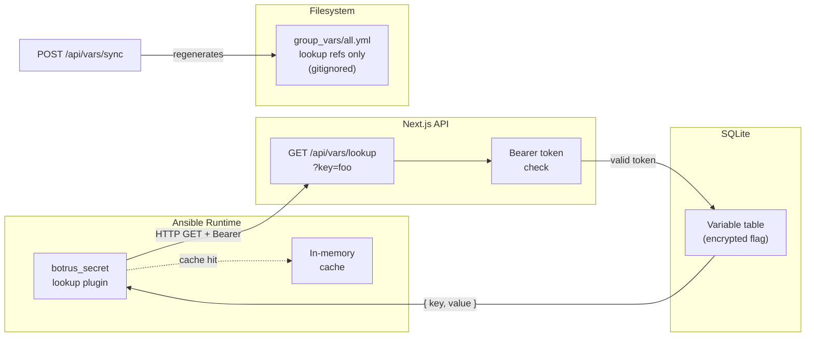
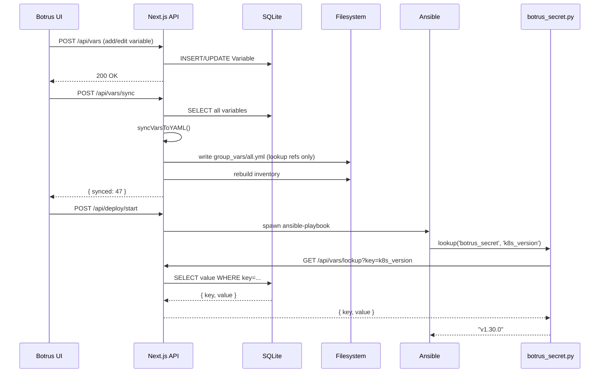

# Botrus Secrets Engine

The Botrus Secrets Engine is a **zero-disk, API-backed secret management system** built into the Botrus K8s dashboard. No secret value ever touches the filesystem — all values are resolved at runtime over an authenticated HTTP channel.

## Architecture



## Components

### 1. Database (`Variable` table)

Prisma model with an `encrypted` boolean flag:

| Column     | Type    | Notes                         |
| ---------- | ------- | ----------------------------- |
| `key`      | String  | Unique variable name          |
| `value`    | String  | The actual secret/value       |
| `category` | String  | Grouping (ansible, kubernetes, secret, etc.) |
| `encrypted`| Boolean | Marks sensitivity             |

### 2. API Endpoint

- **`GET /api/vars/lookup?key=<variable_key>`**
- **Auth:** `Authorization: Bearer <BOTRUS_SECRETS_KEY>`
- **Returns:** `{ "key": "...", "value": "..." }`
- **Errors:** 401 (bad token), 404 (key not found), 500 (DB error)

Used by the Ansible lookup plugin at playbook runtime. The API lives in `front-end/src/app/api/vars/lookup/route.ts`.

### 3. Ansible Lookup Plugin

`ansible-playbook/lookup_plugins/botrus_secret.py`

Standard Ansible lookup plugin. Usage:

```yaml
# In a playbook or template:
ansible_become_password: "{{ lookup('botrus_secret', 'ansible_become_password') }}"
```

Configuration via environment variables:

| Env var               | Default                  | Purpose              |
| --------------------- | ------------------------ | -------------------- |
| `BOTRUS_SECRETS_KEY`  | *(required)*             | Bearer auth token    |
| `BOTRUS_API_URL`      | `http://localhost:4000`  | Next.js API base URL |

Features:
- In-memory cache per playbook run — no duplicate HTTP calls for the same key
- 10-second HTTP timeout
- Raises `AnsibleLookupError` on any failure
- Never writes to disk

### 4. Variable Sync

`POST /api/vars/sync` → regenerates `group_vars/all.yml` and rebuilds the Ansible inventory. Requires write access.

**`front-end/src/lib/sync-vars.ts`** → `syncVarsToYAML()` reads all variables from the DB and writes `group_vars/all.yml` with **lookup refs only** — no values:

```yaml
# all.yml (auto-generated, gitignored)
cluster_cidr: "{{ lookup('botrus_secret', 'cluster_cidr') }}"
k8s_version: "{{ lookup('botrus_secret', 'k8s_version') }}"
ansible_become_password: "{{ lookup('botrus_secret', 'ansible_become_password') }}"
```

Variables are grouped by category with comment headers. This file is regenerated on every deploy/sync and is **gitignored**.

The sync endpoint also:
- Parses `node_*` variables to populate the Node table (`syncNodesFromVars()`)
- Rebuilds the Ansible inventory file from node data (`syncInventoryToFile()`)

### 5. Runtime Wiring

**`ansible.cfg`:**
```ini
lookup_plugins = ./lookup_plugins
```

**`ansible.ts`** spawns Ansible with env vars:
```typescript
env: {
  BOTRUS_SECRETS_KEY: process.env.BOTRUS_SECRETS_KEY || "",
  BOTRUS_API_URL: "http://localhost:4000",
  ANSIBLE_BECOME_PASSWORD: becomePassword,  // sudo, never in argv
}
```

## Security Properties

| Threat                | Mitigation                                      |
| --------------------- | ----------------------------------------------- |
| Secrets on disk       | **Zero** — `all.yml` contains only lookup refs  |
| Secrets in argv       | **Zero** — password flows through stdin/environ |
| Secrets in logs       | Lookup plugin does not log values               |
| Unauthenticated read  | Bearer token required on `/api/vars/lookup`     |
| Replay attacks        | Token is per-session; rotate `BOTRUS_SECRETS_KEY` |

## Seeding the Database

```bash
cd front-end
BECOME_PASSWORD='...' SMB_PASSWORD='...' ./seed-db.sh
```

Seeds all 47 variables (including passwords) into the Prisma SQLite database. The full variable list is below.

## Full Variable List

Variables are grouped by category. All 47 are stored in the `Variable` table with `encrypted: true` for sensitive values.

| Category | Examples |
|----------|----------|
| `ansible` | `ansible_become_password`, `ansible_user`, `ansible_port` |
| `kubernetes` | `k8s_version`, `cluster_cidr`, `service_cidr`, `node_*_ip`, `node_*_hostname`, `node_*_role` |
| `network` | `calico_version`, `metallb_version`, `metallb_ip_range` |
| `storage` | `longhorn_version`, `smb_csi_version`, `nfs_server`, `nfs_path` |
| `ingress` | `traefik_version`, `cert_email` |
| `gitops` | `flux_version`, `flux_git_url`, `flux_git_branch`, `flux_git_path` |
| `secret` | `smb_username`, `smb_password`, `cloudflare_api_token`, `github_token` |

Use the Botrus UI at `/variables` to view, add, or edit variables. Changes take effect on next sync.

## Full Runtime Flow



## Using in Playbooks

Any variable stored in the DB can be referenced in Ansible:

```yaml
- name: Install Kubernetes
  hosts: all
  vars:
    k8s_ver: "{{ lookup('botrus_secret', 'k8s_version') }}"
  tasks:
    - name: Install kubelet
      apt:
        name: "kubelet={{ k8s_ver }}"
        state: present
```

## Troubleshooting

**`BOTRUS_SECRETS_KEY environment variable is not set`**
→ Export the token before running Ansible, or ensure `ansible.ts` is spawning the process.

**`Botrus API returned 401`**
→ Token mismatch. Verify `BOTRUS_SECRETS_KEY` matches what the API expects.

**`Cannot reach Botrus API at http://localhost:4000`**
→ Next.js dev server isn't running. Start with `cd front-end && npm run dev`.

**`Variable not found: X`**
→ Variable `X` isn't in the DB. Run `seed-db.sh` or add it via the `/api/vars` endpoint.
