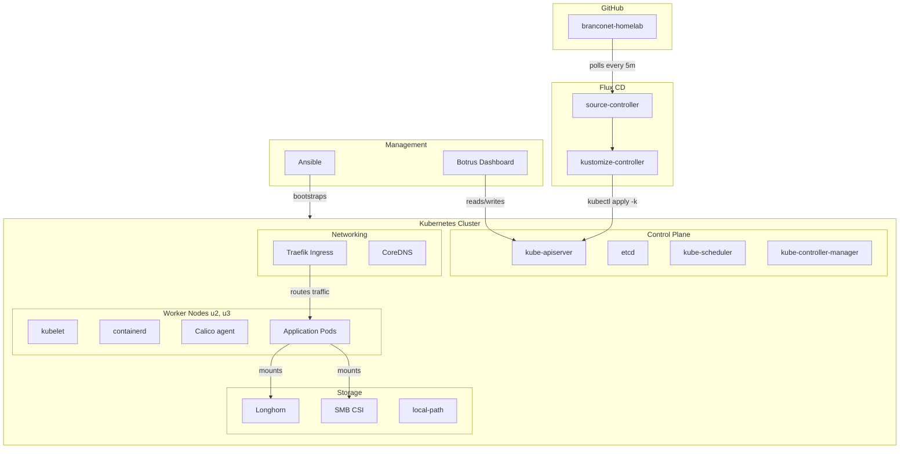

# Tech Stack — branconet Kubernetes Pipeline

## Overview

The branconet homelab runs a 3-node Kubernetes cluster on bare-metal Ubuntu servers. Every layer — from the OS up to the management UI — is open source. This document explains what each piece does and why it was chosen.

---

## Cluster Foundation

### Kubernetes — v1.30.0
**What:** Container orchestration platform. Schedules workloads across nodes, handles networking, service discovery, rolling updates, self-healing.

**Why:** Industry standard. The entire homelab runs as Kubernetes-native workloads — no raw Docker, no Compose. Everything gets the same self-healing, auto-restart, and declarative config.

**Cluster specs:**
| Node | Role | IP | OS |
|------|------|----|----|
| `u1` | control-plane | 192.168.0.25 | Ubuntu 24.04 LTS |
| `u2` | worker | 192.168.0.27 | Ubuntu 24.04 LTS |
| `u3` | worker | 192.168.0.26 | Ubuntu 24.04 LTS |

---

### containerd — v2.2.4
**What:** Container runtime — pulls images, runs containers, manages layers. Replaces Docker Engine.

**Why:** Kubernetes deprecated dockershim in v1.24. containerd is the default CRI runtime, lighter and faster than Docker, and ships with Ubuntu.

---

## Networking

### Calico — v3.28.0
**What:** CNI (Container Network Interface) plugin. Gives every pod its own IP, handles cross-node pod-to-pod routing, enforces NetworkPolicies.

**Why:** Calico uses pure IP routing (no overlays) which is faster and simpler for bare-metal. Supports NetworkPolicy for securing workloads. Chosen over Flannel for policy support and Cilium for simplicity.

---

### CoreDNS — v1.11.1
**What:** Cluster DNS server. Resolves `service-name.namespace.svc.cluster.local` so pods can find each other by name.

**Why:** Default Kubernetes DNS plugin. Lightweight, Go-based, plugin architecture.

---

### Traefik — v2.11.0
**What:** Ingress controller / reverse proxy. Routes external HTTP(S) traffic to services inside the cluster. Supports automatic LetsEncrypt TLS, middleware (auth, rate limiting, redirects), and both standard Kubernetes Ingress + Traefik IngressRoute CRDs.

**Why:** Native Kubernetes integration, auto-discovery of services, built-in dashboard, Middleware CRDs for complex routing rules. Runs as a DaemonSet on all three nodes so any node can receive traffic.

---

## Storage

### Longhorn — v1.6.2
**What:** Cloud-native distributed block storage. Creates replicated volumes across nodes. Provides CSI driver, snapshots, backups, disaster recovery, and a web UI.

**Why:** Gives the cluster persistent, replicated storage without NFS. Volumes survive node failure by replicating across nodes. Perfect for stateful workloads like databases, Plex config, and PVCs that need to outlive pods.

---

### SMB CSI Driver — v1.16.0
**What:** Container Storage Interface driver for Samba/CIFS shares. Mounts existing SMB shares (from a NAS or Windows server) as Kubernetes volumes.

**Why:** The media library lives on existing Samba shares. Instead of migrating terabytes of data, the SMB CSI driver mounts them directly into pods (Plex, file servers, etc.).

---

### local-path-provisioner — v0.0.28 (Rancher)
**What:** Lightweight dynamic provisioner for host-local storage. Creates `hostPath`-backed PVCs on demand.

**Why:** Simple local storage for workloads that don't need replication. Faster than Longhorn for scratch/temp data.

---

### Helm — (via Ansible)
**What:** Kubernetes package manager. Installs charts (pre-packaged Kubernetes applications) with templated values.

**Why:** Some infrastructure components (Traefik, Longhorn, cert-manager) are installed via Helm charts. The Ansible `helm` role manages Helm repo adds and chart installs.

---

## GitOps

### Flux CD — v1.8.5
**What:** GitOps controller. Watches a Git repository, detects changes, and applies them to the cluster. Auto-heals drift, prunes deleted resources.

**Why:** The entire cluster state is in Git (`charts/`). No manual `kubectl apply` needed — push to Git and Flux handles the rest. Gives audit trail, rollback (git revert), and disaster recovery (re-bootstrap from repo).

**Controllers:**
- `source-controller` — polls GitHub for new commits
- `kustomize-controller` — builds Kustomize overlays and applies them

---

## Automation

### Ansible
**What:** Infrastructure as Code automation. SSH's into servers and runs tasks to configure them.

**Why:** Bootstraps the entire cluster from bare metal: installs containerd + kubeadm, initializes the control plane, joins workers, configures networking, storage, DNS, Traefik, and Flux. Can rebuild the cluster from scratch with one playbook.

**Key roles:**
| Role | Purpose |
|------|---------|
| `bootstrap` | Install kubeadm, containerd, kubectl |
| `kubernetes` | Initialize cluster, join workers |
| `network` | Install Calico CNI |
| `storage` | Install Longhorn + SMB CSI |
| `ingress` | Install Traefik |
| `gitops` | Install + bootstrap Flux CD |
| `helm` | Manage Helm repos and releases |
| `dns` | Configure DNS records |
| `longhorn` | Longhorn-specific config |
| `samba` | SMB share setup |
| `nfs` | NFS share setup |
| `secrets` | External secrets management |

---

## Management UI

### Botrus
**What:** Custom Next.js 15 dashboard for cluster management. Lists pods, deployments, nodes, namespaces, ingresses, services, storage — with real-time status, YAML editing, log viewing, shell exec, and user management.

**Stack:**
- Next.js 15 (App Router)
- TypeScript
- Prisma + SQLite (user database)
- Tailwind CSS (dark zinc theme)
- jose (JWT auth)
- kubernetes-client (calls k8s API server)

**Why:** Purpose-built for this homelab. Provides a single pane of glass for all cluster operations without needing `kubectl` or Lens.

---

## Support Infrastructure

### GitHub — `jtmb/branconet-homelab`
**What:** Git hosting, source of truth for Flux, container registry (future).

**Why:** Free, reliable, integrates natively with Flux bootstrap. The `k8s-rewrite` branch holds all manifests and Ansible playbooks.

---

## Stack Diagram

## Version Summary

| Component | Version | Category |
|-----------|---------|----------|
| Kubernetes | v1.30.0 | Orchestration |
| containerd | v2.2.4 | Container Runtime |
| Calico | v3.28.0 | CNI / Networking |
| CoreDNS | v1.11.1 | DNS |
| Traefik | v2.11.0 | Ingress Controller |
| Longhorn | v1.6.2 | Block Storage |
| SMB CSI | v1.16.0 | Samba Storage |
| local-path-provisioner | v0.0.28 | Local Storage |
| Flux CD | v1.8.5 | GitOps |
| Helm | (via Ansible) | Package Manager |
| Ansible | (latest) | Automation |
| Botrus | (custom) | Management UI |
| Ubuntu | 24.04 LTS | Operating System |
