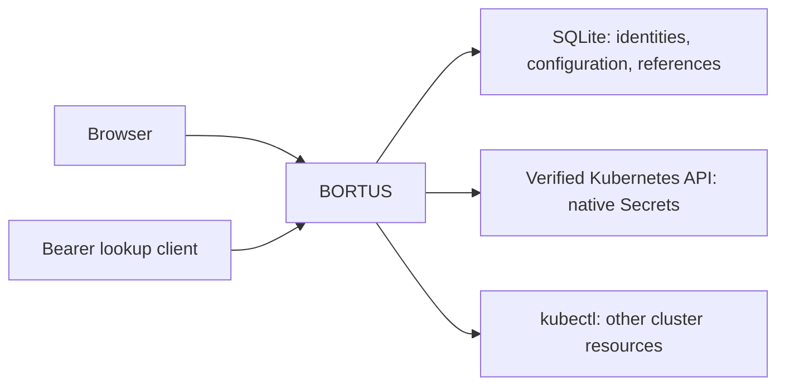

# BORTUS technology stack

BORTUS is the Kubernetes management application at `k8s-rewrite/front-end/`. Its source and documentation are included in `main` alongside the existing Swarm homelab. Kubernetes provisioning, charts and live Flux source configuration are maintained separately; this application publication does not replace those systems.

| Component | Declared version | Role |
|---|---|---|
| Node.js | 22 (Docker image) | Application runtime |
| Next.js | 15.5.27 | App Router and standalone server |
| React / React DOM | ^18.3.0 | Dashboard UI |
| TypeScript | ^5.7.0 | Strict type checking |
| Prisma / Prisma Client | ^6.0.0 | SQLite schema and migrations |
| Tailwind CSS | ^3.4.0 | Dark zinc and indigo theme |
| jose | ^6.2.3 | HS256 session JWTs |
| bcryptjs | ^3.0.3 | User password hashing |
| @kubernetes/client-node | ^1.4.0 | Native Secret API client |
| node-fetch | 2.7.0 | Verified HTTPS transport |
| zod | ^3.23.0 | Input validation |
| tsx | ^4.20.6 | Node test runner and TypeScript execution |
| kubectl | v1.34.1 Docker default | Other dashboard resource operations |

`package-lock.json` records resolved dependency versions. Override Docker `KUBECTL_VERSION` to match the target cluster. Cluster, CNI, storage and Flux versions belong to the operator's deployment configuration rather than this application package.

SQLite stores users/password hashes, roles, nonsecret configuration, jobs and explicit Secret reference metadata. Native Kubernetes Secrets store credential values. Signing/lookup keys are supplied externally; no SQLite-to-cluster pushes or startup DB/SSH kubeconfig bootstrap run.

```mermaid
flowchart LR
  Browser --> BORTUS
  Lookup["Bearer lookup client"] --> BORTUS
  BORTUS --> DB["SQLite: identities, configuration, references"]
  BORTUS --> API["Verified Kubernetes API: native Secrets"]
  BORTUS --> CLI["kubectl: other cluster resources"]
```

The image exposes port 4000, uses UID/GID 1000 and a persistent SQLite volume at `/data`. See [deployment contract](BORTUS-DEPLOYMENT.md) for probes, credentials and namespace-scoped RBAC.

The separate private `jtmb/branconet-charts` repository owns deployment charts,
values and Flux configuration. Its main → CI → validated → Flux pipeline is the
only application deployer. This repository's BORTUS source/build work is independent;
see [Flux contract and image releases](FLUX-GITOPS.md).
