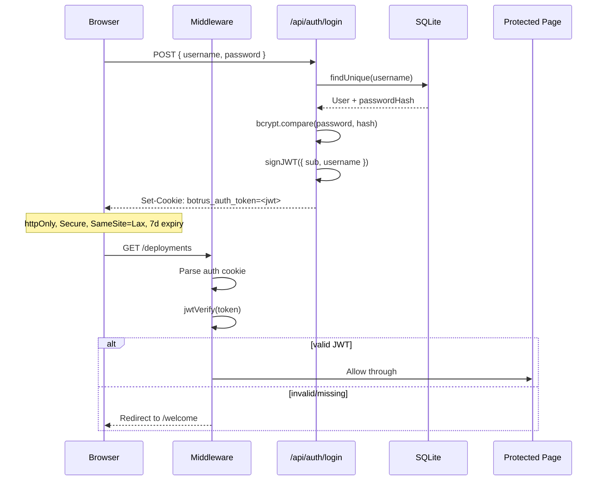

# Botrus User Permissions

The Botrus K8s dashboard uses a **two-role permission system** with cookie-based JWT authentication. Roles are enforced at three layers: middleware (auth gate), API routes (write gating), and client UI (conditional rendering).

---

## Role System

| Role | Description |
|------|-------------|
| `write` | Full access — view everything, modify resources, run deployments, manage users, sync variables |
| `readonly` | Read-only access — view dashboards, pods, nodes, deployments. Cannot modify, delete, or deploy |

There is no third role. No granular per-resource permissions. Every user is either `readonly` or `write`.

Roles are stored in the `User.role` column in SQLite (`prisma/schema.prisma`):

```prisma
model User {
  id           String   @id @default(cuid())
  username     String   @unique
  passwordHash String
  role         String   @default("readonly") // "readonly" | "write"
  createdAt    DateTime @default(now())
}
```

---

## Authentication Flow



### JWT Payload

```typescript
{
  sub: string;      // user.id
  username: string; // user.username
  iat: number;      // issued at
  exp: number;      // 7 days from issue
}
```

The JWT does **not** carry the role. Roles are always looked up from the database on every authorization check — so role changes take effect immediately without re-login.

### Cookie

| Property | Value |
|----------|-------|
| Name | `botrus_auth_token` |
| HttpOnly | `true` (inaccessible to JS) |
| Secure | `true` in production |
| SameSite | `lax` |
| Max Age | 7 days |

---

## Middleware: Authentication Gate

`src/middleware.ts` runs on every request. It intercepts requests before they reach pages or API routes.

**Public paths** (no auth required):
- `/welcome`, `/auth/login`, `/auth/register`
- `/api/auth/*`, `/api/cluster/info`, `/_next/*`, `/favicon.ico`

**Protected paths** (everything else):
- **Page requests** → redirect to `/welcome` if no valid cookie
- **API requests** → return `401 Unauthorized` if no valid cookie

The middleware only checks whether a user is authenticated — it does **not** check roles. Role enforcement happens deeper.

---

## API-Level Authorization: `requireWrite()`

`src/lib/permissions.ts` provides two functions:

### `requireWrite()`

Used in every API route that modifies state. Pattern:

```typescript
import { requireWrite } from "@/lib/permissions";

export async function POST(request: NextRequest) {
  const auth = await requireWrite();
  if (auth instanceof NextResponse) return auth; // 401 or 403

  // auth.id, auth.username available — user has write access
}
```

Checks performed:
1. Is there a valid session? → No = `401 Unauthorized`
2. Does the user's DB role equal `"write"`? → No = `403 Forbidden — write access required`

### `getCurrentRole()`

Returns the session's role without enforcing anything. Used for client-side conditional rendering:

```typescript
const session = await fetch("/api/auth/session").then(r => r.json());
// session.role === "write" | "readonly"
```

---

## Write-Gated API Routes

Every mutating endpoint calls `requireWrite()`. Read-only endpoints (like `GET /api/users`, `GET /api/vars`, `GET /api/cluster/*`) do **not** gate on role — any authenticated user can read.

| Endpoint | Method | Gate |
|----------|--------|------|
| `/api/nodes` | POST | `requireWrite` |
| `/api/nodes/[id]` | PATCH, DELETE | `requireWrite` |
| `/api/users` | POST | `requireWrite` |
| `/api/users/[id]` | PATCH, DELETE | `requireWrite` |
| `/api/vars` | POST, PATCH, DELETE | `requireWrite` |
| `/api/vars/sync` | POST | `requireWrite` |
| `/api/settings` | POST, PATCH | `requireWrite` |
| `/api/deploy/start` | POST | `requireWrite` |
| `/api/deploy/stop` | POST | `requireWrite` |
| `/api/deploy/history` | POST | `requireWrite` |
| `/api/cluster/*/delete` | POST | `requireWrite` |
| `/api/cluster/*/yaml` | PATCH | `requireWrite` |
| `/api/cluster/refresh` | POST | `requireWrite` |
| `/api/cluster/pods/*/shell` | POST | `requireWrite` |
| `/api/flux/repos/*` | POST, PATCH, DELETE | `requireWrite` |

---

## Registration Rules

`POST /api/auth/register` enforces these rules:

1. **First user ever → `write` role automatically.** The system needs at least one admin.
2. **Subsequent users → `readonly` role.** New users start as viewers.
3. **Registration lock:** After the first user exists, registration is disabled unless:
   - `ALLOW_REGISTRATION=true` environment variable is set, OR
   - The `AppSetting` with key `allow_registration` is `"true"` (set via the settings UI)

---

## User Management

Users with `write` role can manage other users at `/users` or via the API:

### Create User — `POST /api/users`
- Username: 3–30 chars, `[a-zA-Z0-9_-]`
- Password: 8+ characters
- Role: optional, defaults to `readonly`

### Update User — `PATCH /api/users/[id]`
- Can change role (`readonly` ↔ `write`) or reset password
- **Cannot change own role** (self-protection)
- **Cannot demote the last write user** (prevents lockout)

### Delete User — `DELETE /api/users/[id]`
- **Cannot delete yourself**
- **Cannot delete the last write user** (prevents lockout)

---

## Client-Side Role Awareness

The session endpoint `GET /api/auth/session` returns the user's role:

```json
{
  "authenticated": true,
  "username": "admin",
  "role": "write",
  "hasUsers": true,
  "registrationOpen": false
}
```

The users management page (`/users`) fetches this session to conditionally render admin controls:

```typescript
const isWrite = currentRole === "write";

// Only write users see "Create User" button
{isWrite && <CreateUserButton />}

// Demotion warning when editing the last write user
{editing.role === "write" && editRole === "readonly" && (
  <Warning>Demoting the last write user will lock everyone out!</Warning>
)}
```

---

## Security Properties

| Threat | Mitigation |
|--------|------------|
| Token theft | Cookie is HttpOnly (inaccessible to JS) |
| Token replay | Tokens expire after 7 days |
| Privilege escalation | Role stored server-side in DB, not in JWT |
| Self-demotion | Cannot change own role |
| Complete lockout | Cannot delete/demote last write user |
| Unauthorized registration | Locked after first user unless explicitly enabled |
| Session hijacking | Secure cookies in production (HTTPS only) |

---

## Development vs Production

| Setting | Development | Production |
|---------|-------------|------------|
| Cookie Secure flag | `false` | `true` |
| JWT secret source | `.env.local` (auto-generated) | `.env.local` / env var |
| HTTPS required | No | Yes (for cookie) |

The JWT secret is auto-generated on first app start (`ensureJwtSecret()` in `auth-server.ts`) if not already set in `BOTRUS_JWT_SECRET`.

---

## Troubleshooting

**"Authentication required" (401) on API call**
→ Cookie expired or missing. Log in again at `/auth/login`.

**"Forbidden — write access required" (403) on write endpoint**
→ Your user has `readonly` role. Ask a `write` user to promote you at `/users`.

**"You cannot change your own role" (403)**
→ Self-serve role changes aren't allowed. Ask another `write` user to change it.

**"Cannot demote/delete the last write user" (403)**
→ Promote another user to `write` first, then demote/delete.

**"Registration is locked" (403)**
→ Set `ALLOW_REGISTRATION=true` in `.env.local`, or enable it via `/settings` (requires write access).

**Can't log in after restart**
→ If the JWT secret changed, all existing cookies become invalid. Re-login.
