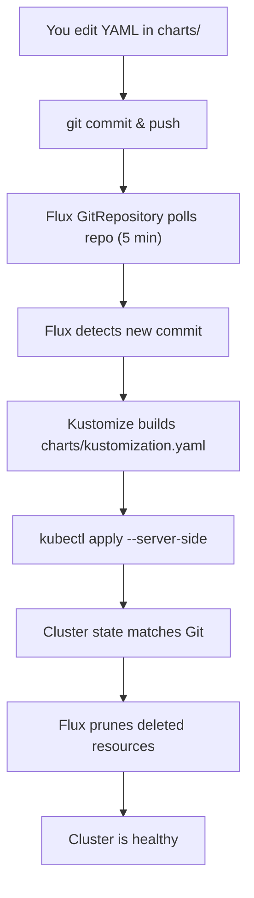

# Clusters — Flux Bootstrapping & Multi-Cluster Layout

## What is this directory?

Each subdirectory under `clusters/` represents one Kubernetes cluster managed by Flux CD. The directory name is your **cluster identifier** — it can be anything that makes sense to you (physical location, environment, purpose).

```
clusters/
├── prd/              ← production cluster ("branconet")
│   └── flux-system/
│       └── gotk-sync.yaml
├── dev/              ← development / staging cluster
│   └── flux-system/
│       └── gotk-sync.yaml
└── README.md         ← this file
```

The `gotk-sync.yaml` inside each cluster's `flux-system/` directory is the **bootstrap manifest** — it tells Flux which Git repo, branch, and path to sync for that specific cluster.

## How deployment works (end-to-end)



### Step-by-step

1. **You make a change** — edit any manifest in `k8s-rewrite/charts/`, or add a new app directory
2. **Commit & push** to the `k8s-rewrite` branch
3. **Flux detects it** — the `GitRepository` polls `github.com/jtmb/branconet-homelab.git` every 5 minutes
4. **Kustomize builds it** — `charts/kustomization.yaml` includes every app subdirectory, kustomize flattens them all into one big YAML bundle
5. **Applied to cluster** — Flux runs the equivalent of `kubectl apply -k charts/ --server-side`
6. **Drift correction** — if someone `kubectl edit`-ed something manually, Flux reverts it
7. **Pruning** — if you delete a file from Git, Flux removes it from the cluster

## Bootstrap a cluster (one-time setup)

Run this **once per cluster** to install Flux:

```bash
# Install Flux CLI on your workstation
curl -s https://fluxcd.io/install.sh | bash

# Bootstrap — this installs Flux controllers on the cluster
# AND commits gotk-sync.yaml back to your repo
flux bootstrap github \
  --owner=jtmb \
  --repository=branconet-homelab \
  --branch=k8s-rewrite \
  --path=./k8s-rewrite/clusters/prd \
  --personal
```

| Flag | What it does |
|------|-------------|
| `--owner` | Your GitHub username or org |
| `--repository` | The Git repo name |
| `--branch` | Branch Flux watches for changes |
| `--path` | Where Flux writes `gotk-sync.yaml` — **use a different path per cluster** |
| `--personal` | Use a personal access token (not GitHub App) |

After bootstrap:
- Flux controllers are running on the cluster
- A `GitRepository` + `Kustomization` are created in the `flux-system` namespace
- The cluster immediately starts syncing `charts/kustomization.yaml`
- `gotk-sync.yaml` is committed to your repo at the specified path

## Adding a second cluster

```bash
# New cluster, new path:
flux bootstrap github \
  --owner=jtmb \
  --repository=branconet-homelab \
  --branch=k8s-rewrite \
  --path=./k8s-rewrite/clusters/dev \
  --personal
```

Both clusters sync the same `charts/` directory. If you want different apps per cluster, create separate root kustomizations:

```
charts/
├── kustomization.yaml         # shared apps (both clusters)
├── prod-only/
│   └── kustomization.yaml     # production-only apps
└── dev-only/
    └── kustomization.yaml     # dev-only apps
```

Then point each cluster's `gotk-sync.yaml` at the appropriate root.

## Viewing cluster status

```bash
# What clusters are managed?
ls clusters/

# Check sync status (run on a machine with kubectl pointed at the cluster)
kubectl get gitrepositories -n flux-system
kubectl get kustomizations -n flux-system

# Or with flux CLI:
flux get sources git -n flux-system
flux get kustomizations -n flux-system
```

Healthy output:
```
NAME               READY   STATUS
branconet-charts   True    Applied revision: k8s-rewrite@sha1:abcdef1234...
```

## Anatomy of gotk-sync.yaml

```yaml
---
# Tells Flux: "watch this repo, this branch"
apiVersion: source.toolkit.fluxcd.io/v1
kind: GitRepository
metadata:
  name: flux-system
  namespace: flux-system
spec:
  interval: 5m
  url: https://github.com/jtmb/branconet-homelab.git
  ref:
    branch: k8s-rewrite
---
# Tells Flux: "build this path, apply it, auto-heal drift"
apiVersion: kustomize.toolkit.fluxcd.io/v1
kind: Kustomization
metadata:
  name: flux-system
  namespace: flux-system
spec:
  interval: 5m
  path: ./k8s-rewrite/charts
  prune: true
  sourceRef:
    kind: GitRepository
    name: flux-system
```

| Field | Purpose |
|-------|---------|
| `interval: 5m` | How often Flux checks Git for changes |
| `prune: true` | Delete cluster resources when removed from Git |
| `path` | Directory in the repo containing the root `kustomization.yaml` |
| `sourceRef` | Which `GitRepository` to pull from |

## Common operations

### Force an immediate sync
```bash
flux reconcile kustomization branconet-charts -n flux-system
```

### Pause sync (stop Flux from touching an app)
```bash
# Pause the entire kustomization:
flux suspend kustomization branconet-charts -n flux-system

# Or suspend a single app (if it has its own Flux Kustomization):
flux suspend kustomization plex -n flux-system

# Resume:
flux resume kustomization branconet-charts -n flux-system
```

### See what Flux would change
```bash
flux diff kustomization branconet-charts -n flux-system
```

### Check for drift (manual changes not in Git)
```bash
# If READY is False, something is out of sync:
flux get kustomizations -n flux-system

# Get details:
kubectl describe kustomization branconet-charts -n flux-system
```

## Troubleshooting

### "kustomize build failed"
Flux couldn't compile the YAML. Check:
- `kubectl apply -k charts/ --dry-run=server` from your repo root
- Missing kustomization.yaml in a referenced subdirectory
- YAML syntax errors in any manifest

### "Applied revision: sha1:OLD_HASH" (stale)
Flux is stuck on an old commit. Usually means it can't reach GitHub:
```bash
kubectl get gitrepository branconet-charts -n flux-system -o yaml | grep -A10 status
```

### "Reconciliation in progress" (stuck)
The sync is hanging. Check:
```bash
kubectl get events -n flux-system --sort-by='.lastTimestamp'
```

### New app not appearing
Did you:
1. Create the app's `kustomization.yaml` in `charts/<app>/`?
2. Add it to `charts/kustomization.yaml` resources list?
3. Commit **and push** both changes?

Remember: Flux watches the **remote** Git repo, not your local files. Changes only apply after `git push`.

## Relationship to other directories

| Directory | Role |
|-----------|------|
| `clusters/` | **Cluster identity** — which cluster syncs what |
| `charts/` | **Source of truth** — all Kubernetes manifests live here |
| `ansible-playbook/roles/gitops/` | **Automation** — Ansible role to install + bootstrap Flux |
| `docs/FLUX-GITOPS.md` | Day-to-day Flux operations reference |
